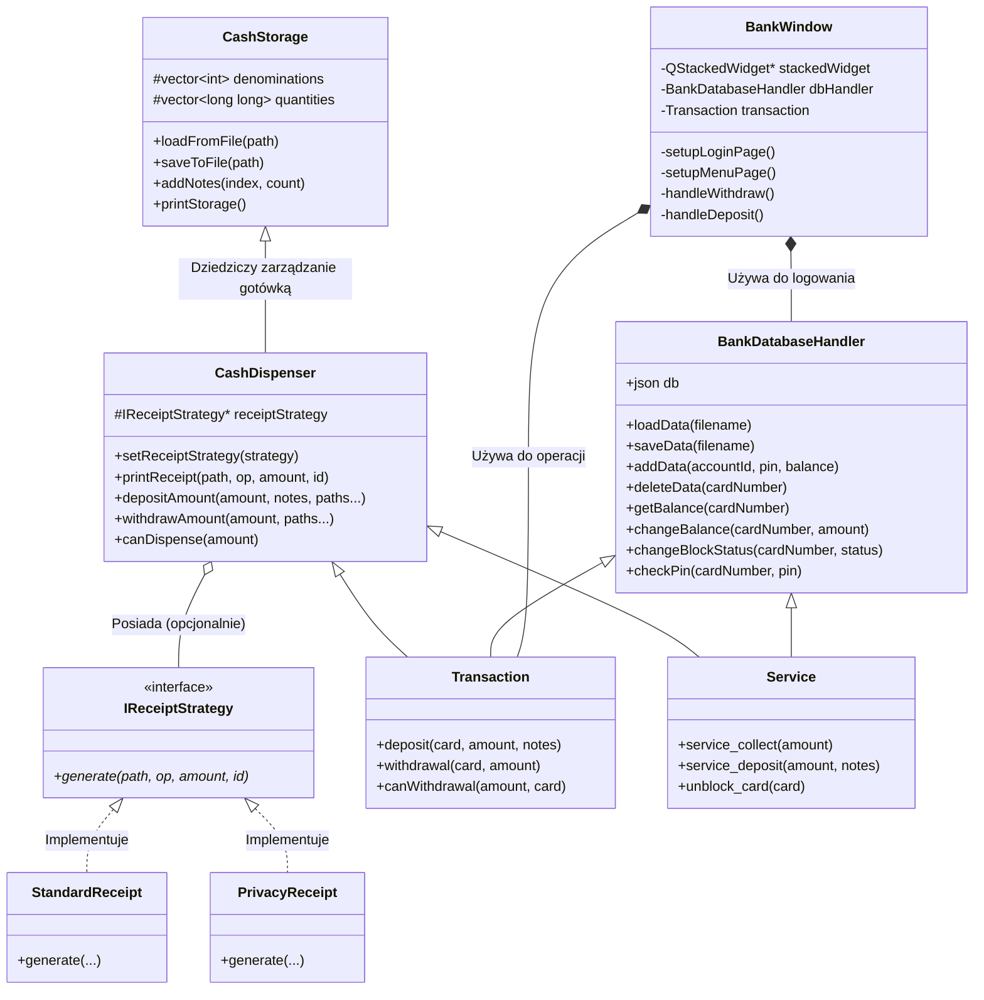

# UML Class Diagram for ATM_Project

```mermaid
classDiagram
    %% --- WARSTWA DANYCH I SPRZĘTU ---
    class CashStorage {
        #vector~int~ denominations
        #vector~long long~ quantities
        +loadFromFile(path)
        +saveToFile(path)
        +addNotes(index, count)
        +printStorage()
    }

    class BankDatabaseHandler {
        +json db
        +loadData(filename)
        +saveData(filename)
        +addData(accountId, pin, balance)
        +deleteData(cardNumber)
        +getBalance(cardNumber)
        +changeBalance(cardNumber, amount)
        +changeBlockStatus(cardNumber, status)
        +checkPin(cardNumber, pin)
    }

    %% --- WARSTWA LOGIKI BIZNESOWEJ (CASH MACHINE) ---
    class CashDispenser {
        #IReceiptStrategy* receiptStrategy
        +setReceiptStrategy(strategy)
        +printReceipt(path, op, amount, id)
        +depositAmount(amount, notes, paths...)
        +withdrawAmount(amount, paths...)
        +canDispense(amount)
    }

    %% --- WZORZEC STRATEGIA (Nowość) ---
    class IReceiptStrategy {
        <<interface>>
        +generate(path, op, amount, id)*
    }

    class StandardReceipt {
        +generate(...)
    }

    class PrivacyReceipt {
        +generate(...)
    }

    %% --- WARSTWA TRANSAKCYJNA I SERWISOWA ---
    class Transaction {
        +deposit(card, amount, notes)
        +withdrawal(card, amount)
        +canWithdrawal(amount, card)
    }

    class Service {
        +service_collect(amount)
        +service_deposit(amount, notes)
        +unblock_card(card)
    }

    %% --- WARSTWA GUI ---
    class BankWindow {
        -QStackedWidget* stackedWidget
        -BankDatabaseHandler dbHandler
        -Transaction transaction
        -setupLoginPage()
        -setupMenuPage()
        -handleWithdraw()
        -handleDeposit()
    }

    %% --- RELACJE ---
    
    %% Dziedziczenie (Inheritance)
    CashStorage <|-- CashDispenser : Dziedziczy zarządzanie gotówką
    IReceiptStrategy <|.. StandardReceipt : Implementuje
    IReceiptStrategy <|.. PrivacyReceipt : Implementuje
    
    %% Wielodziedziczenie (Multiple Inheritance)
    CashDispenser <|-- Transaction
    BankDatabaseHandler <|-- Transaction
    
    CashDispenser <|-- Service
    BankDatabaseHandler <|-- Service

    %% Agregacja (Aggregation) - Wzorzec Strategia
    CashDispenser o-- IReceiptStrategy : Posiada (opcjonalnie)

    %% Kompozycja (Composition) - GUI
    BankWindow *-- Transaction : Używa do operacji
    BankWindow *-- BankDatabaseHandler : Używa do logowania
```
